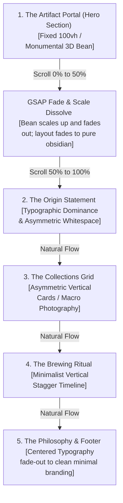

# Creative & Technical Director's Blueprint: Crema / Noir Redesign
## Concept: "The Monumental Silence of Purity"

This document outlines the brand-new conceptual direction and layout architecture for the Crema/Noir flagship digital experience. It shifts the design from an interactive technical demonstration to an authoritative, ultra-high-end luxury editorial showcase.

---

## 1. The Core Experience & Emotional Resonance

### The First 3 Seconds: "The Quiet Luxury of a Blank Canvas"
When the user lands on Crema/Noir, they must experience a sensation of **monumental silence, exclusivity, and tactile weight**. There is no auto-playing background video, no sudden movement, and no flashing UI indicators. 

*   **Atmosphere**: The background is a rich, warm, textured matte black (`#0a0908` with a fine-grain overlay). The center of the screen features a single, perfectly lit 3D coffee bean artifact, suspended in dark space.
*   **The Typography**: A single, thin, widely spaced header reads `C R E M A  /  N O I R` in a pale, warm ivory tone (`#f9f6f0`).
*   **Emotional Goal**: The user should feel as though they have stepped into a high-end luxury exhibition or a gallery. The absence of immediate scroll prompts, buttons, or indicators signals absolute brand confidence. It demands that the user slow down and adjust to the unhurried tempo of the ritual.

---

## 2. Spatial & Layout Architecture

We are replacing the pinned horizontal panels with a **highly structured, vertical editorial flow**. The vertical pacing uses asymmetric grids, monumental typography, and massive negative space to create a rhythm that feels authoritative, deliberate, and effortless.

### The Vertical Scroll Sequence
1.  **Section 1: The Artifact Portal (Hero)**: A pinned full-viewport frame (`100vh`). The 3D coffee bean is the centerpiece. As the user begins their scroll (0% to 50% scroll progress), the bean slowly scales up (`scale: 1.6 -> 2.0`) and fades out (`opacity: 1 -> 0`), dissolving into the canvas. Simultaneously, the background smoothly transitions from the warm matte charcoal to a deep, dark obsidian (`#050505`).
2.  **Section 2: The Origin Statement (Typographic Dominance)**: As the bean dissolves, the page enters a massive, empty space containing a large, high-contrast, left-aligned statement in an elegant serif typeface. Surrounded by a $30\text{vh}$ vertical whitespace buffer, it states: *"A quiet return to purity. Single-origin lots, roasted to reveal what is essential."*
3.  **Section 3: The Collections Grid (Tactile Grid)**: Rather than sliding cards sideways, the collections are laid out in a vertical, **asymmetric staggered grid**. The left column card sits lower than the right, forcing the user's eye to follow a zig-zag reading path. The backgrounds of the cards are a highly transparent matte cream (`#f9f6f0/[0.02]`) with razor-thin borders, placed over high-contrast, black-and-white macro photography of coffee beans and extraction processes.
4.  **Section 4: The Brewing Ritual (Process Flow)**: Steps are laid out in a single vertical column. The numbers `01`, `02`, `03`, `04` are styled in a massive, light grey display font, while the descriptions sit adjacent in a narrow column, separated by wide gaps of dark negative space.
5.  **Section 5: Philosophy & Footer**: The final section closes the loop with a centered, minimalist brand statement, fading out to a clean, simple footer.

---

## 3. The Single Definitive Focal Point

### The Monumental Hero Artifact
Instead of panning across slides and distracting the viewer, the **3D coffee bean is treated as a single, monumental sculpture** that exists solely in the Hero section. 

*   **Lighting Model**: The 3D bean is lit using **Chiaroscuro lighting** (extreme contrast between shadow and light):
    *   *Key Light*: A sharp, warm gold directional light (`#ffd7a3`) hitting the bean from the top-right to define the surface crevices and contours.
    *   *Fill Light*: A soft, deep bronze point light (`#8b4513`) placed low on the left to reveal the underside texture.
    *   *Cast Shadow*: The bean does not float in a void; it casts a soft, blurred shadow onto a virtual background plane, giving it physical weight.
*   **Dissolve Transition**: On scroll, the bean's spatial position remains pinned to the viewport center. It undergoes a **dissolve-out-of-frame**:
    *   It scales up slightly to simulate proximity.
    *   Its opacity fades to 0.
    *   The WebGL renderer is fully disabled/destroyed once it is off-screen to conserve GPU resources.

---

## 4. Psychological & Technical Rationale

| Design Choice | Psychological Reason | Technical Reason |
| :--- | :--- | :--- |
| **Discarding Background Video** | Video loops draw the eye away from the core typography, creating unconscious visual fatigue and reducing readability. | Drastically reduces network payload and CPU load, ensuring a perfect 60fps scrolling experience. |
| **Hero-Only 3D Bean** | Suspending the 3D element after the Hero signals a shift from "gimmick" to "content". It prevents the 3D model from feeling overused. | Allows the Three.js WebGL context to be completely disposed of after the first screen fold, freeing up GPU memory. |
| **Massive Whitespace ($30\text{vh}+$ margins)** | Generates "breathing room" that feels expensive. In luxury design, **space is the ultimate signal of wealth and exclusivity**. | Simplifies DOM structure and prevents layout clipping bugs on narrow viewports. |
| **Asymmetric Card Layouts** | Prevents the page from looking like a standard e-commerce template. The eye lingers longer on irregular visual patterns. | Leverages modern CSS Grid and Flexbox capabilities cleanly, with minimal JavaScript dependencies. |
| **Warm Matte Color Palette (`#f9f6f0` on `#0a0908`)** | Pure white-on-black looks harsh and cheap (high-glare). The warm cream and charcoal simulate premium textured paper and organic stone. | Reduces eye strain and creates a more comfortable reading environment on OLED/high-contrast monitors. |
| **Tactile SVG Film Grain Overlay** | Adds microscopic detail to the dark colors, simulating film photography and physical textures. | Created dynamically using a tiny, cached inline SVG turbulence string, avoiding heavy image assets. |

---

## 5. Development Steps (Phase II Refactor Strategy)

To implement this design system in the codebase:
1.  **Refactor `App.tsx`**: Remove the `w-[300vw]` horizontal track and the $300\text{vh}$ runway. Set the layout back to a standard vertical flow with normal scrolling sections.
2.  **Reposition `Coffee3D.tsx`**: Bind the `Coffee3D` container solely to the first section fold (`100vh`). Hook its ScrollTrigger to fade out opacity and scale the mesh as the scroll position goes from $0$ to $100\text{vh}$.
3.  **Update `index.css`**: Define the global design tokens (`--color-obsidian`, `--color-cream-warm`, `--color-gold-warm`) and apply the SVG noise overlay fixed container globally.
4.  **Refactor component styles**: Update `ProductGrid`, `BrewingRitual`, and `Philosophy` components to use the new asymmetric, high-contrast, spacious styling guidelines.
